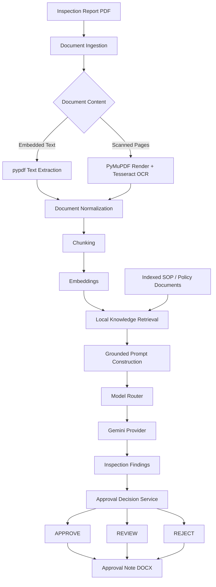
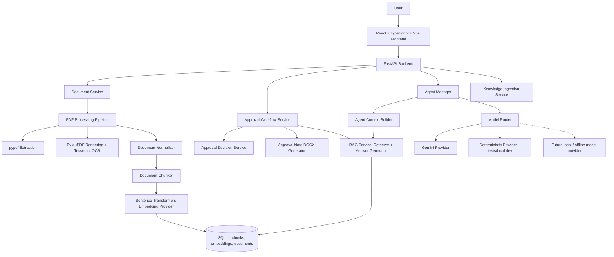

# AI Workbench

**Local AI-powered document intelligence, knowledge grounding, agent orchestration, and real-world deliverable generation.**


> Upload a document → understand it → retrieve relevant organizational knowledge → run the right AI workflow → produce an actionable deliverable.

AI Workbench is not "ask an LLM about a PDF." It is a local document-intelligence and agent-execution platform: documents are parsed and OCR'd when needed, chunked and embedded into a local knowledge base, retrieved with semantic search, reasoned over by a routed AI model, and — for its flagship workflow — resolved by explicit, auditable decision rules into a real DOCX deliverable.

```
USER
 ↓
AI WORKBENCH (React + FastAPI)
 ↓
AGENT MANAGER
 ↓
MODEL ROUTER
 ↓
DOCUMENT INTELLIGENCE + LOCAL RAG
 ↓
LOCAL TOOLS (decision logic, DOCX generation)
 ↓
REAL DELIVERABLE
```

---

## Table of Contents

- [The Problem](#the-problem)
- [Core Concept](#core-concept)
- [Flagship Workflow](#flagship-workflow)
- [End-to-End Execution Flow](#end-to-end-execution-flow)
- [Architecture](#architecture)
- [Component Breakdown](#component-breakdown)
- [Model Routing](#model-routing)
- [Local RAG / Knowledge Grounding](#local-rag--knowledge-grounding)
- [Inspection Approval Example](#inspection-approval-example)
- [Decision Engine](#decision-engine)
- [Document Support](#document-support)
- [Project Structure](#project-structure)
- [API Overview](#api-overview)
- [Installation](#installation)
- [Testing](#testing)
- [Roadmap](#roadmap)

---

## The Problem

Enterprise information is routinely trapped inside PDFs — inspection reports, scanned forms, SOPs, policies, maintenance logs — that people have to process by hand:

1. Open the document
2. Manually read it
3. Search through SOPs and policies for relevant clauses
4. Interpret findings against those rules
5. Make a decision
6. Write up a report or approval note

This is slow, repetitive, inconsistent between reviewers, and gets worse the moment a document is scanned rather than digitally native. Organizational knowledge (SOPs, policies) also tends to sit in folders nobody searches, so decisions are made without checking what the rules actually say.

AI Workbench turns this into a reusable, auditable pipeline instead of a manual chore.

## Core Concept

AI Workbench is built as a **platform**, not a single-purpose app. It exposes a small set of reusable primitives:

| Primitive | What it does |
|---|---|
| **Document Intelligence** | Ingests PDFs, detects embedded vs. scanned content, extracts text, runs OCR, normalizes the result |
| **Knowledge Retrieval (Local RAG)** | Chunks and embeds documents, stores them locally, retrieves relevant evidence by semantic similarity |
| **Agent Execution** | Builds grounded prompts from retrieved evidence and runs a task through a model |
| **Model Routing** | Selects the right model provider for a requested capability, without workflow code depending on a specific vendor |
| **Local Tools / Deliverable Generation** | Deterministic decision logic and real output files (currently DOCX approval notes) |

The **flagship workflow** — inspection report analysis and approval — is where all of these primitives currently come together end-to-end. The rest of the platform (document library, knowledge ingestion API, generic agent execution) is built to support additional workflows on the same foundation.

---

## Flagship Workflow

**Inspection Report → OCR/Extraction → Local SOP Retrieval (RAG) → AI Analysis → Deterministic Decision → DOCX Approval Note**



**Stage notes:**

- **Document Ingestion** — the file is uploaded, validated, and persisted; metadata is stored in SQLite.
- **Content detection** — a dedicated detector decides whether a PDF's pages contain embedded text, are scanned images, or a mix.
- **Extraction / OCR** — embedded text is pulled with `pypdf`; scanned pages are rasterized with PyMuPDF and read with Tesseract OCR.
- **Normalization** — extracted and OCR'd content is merged into a single, page-aware document representation.
- **Chunking & Embeddings** — normalized content is split into semantic chunks and embedded with a sentence-transformers model.
- **Local Knowledge Retrieval** — the inspection text (or a user query) is embedded and compared against the locally indexed knowledge base (SOPs, policies, other ingested documents) using cosine similarity with a relevance threshold, so only the most relevant evidence is surfaced.
- **Grounded Prompt Construction** — retrieved evidence is attached to the task instruction, with an explicit instruction not to invent facts when no evidence is found.
- **Model Router → Gemini** — the grounded prompt is routed to the model provider registered for the `DOCUMENT` capability (currently Gemini).
- **Approval Decision Service** — the model's output (inspection findings with severity) is passed to explicit, deterministic rules — not the LLM — to reach APPROVE / REVIEW / REJECT.
- **DOCX Approval Note** — the decision, summary, and supporting evidence are rendered into a downloadable Word document via `python-docx`.

## End-to-End Execution Flow

1. Upload a document
2. Validate file type and size
3. Persist the document and its metadata (SQLite + local disk)
4. Detect whether PDF content is embedded text, scanned, or mixed
5. Extract embedded text (`pypdf`)
6. Render and OCR scanned pages when required (PyMuPDF + Tesseract)
7. Normalize extracted/OCR'd content into one document representation
8. Split the normalized content into semantic chunks
9. Generate embeddings for each chunk
10. Store chunks and embeddings locally
11. Retrieve relevant local knowledge for the task at hand (per-document or across the whole knowledge base)
12. Build a grounded prompt from retrieved evidence
13. Route the task to the appropriate model provider
14. Analyze the inspection text with the routed model
15. Extract structured findings (with severity) from the model's output
16. Apply deterministic approval-decision logic to the findings
17. Generate the DOCX approval note
18. Serve the generated file for download

Deterministic business logic — the approval decision itself — is deliberately kept **outside** the LLM. The model produces findings; a plain Python rules engine decides the outcome. This keeps the outcome explainable and reproducible.

---

## Architecture



The provider abstraction (`ModelRouter` / `ModelProvider`) means a new model — local or hosted — can be added by implementing one interface, without touching workflow logic. Only the Gemini provider is wired up for production use today; a `DeterministicModelProvider` exists purely for tests and local development. A fully local/offline inference provider is an extension point, not an implemented feature.

## Component Breakdown

### Frontend
- React 19 + TypeScript + Vite 8, routed with `react-router-dom`
- **Dashboard** (implemented): upload dropzone, the approval workflow panel (run the flagship workflow against an uploaded document and download the resulting DOCX), quick actions, recent workflows, and an activity panel
- **Documents** (implemented): a live document library backed by `GET /api/documents`
- **Workflows / Knowledge / SOPs / History** pages exist as routed placeholders today — the underlying APIs work, but these dedicated UIs are not yet built out (see [Roadmap](#roadmap))

### Backend
- FastAPI application factory (`app/main.py`) with CORS configured from settings
- Service-oriented layout: routes stay thin and delegate to services; services depend on repositories and are wired via FastAPI dependency injection (`app/dependencies.py`)
- SQLite-backed persistence for documents, chunks, and embeddings

### Document Intelligence
- `pdf_content_detector.py` — classifies a PDF's pages as embedded-text, scanned, or mixed
- `pypdf_processor.py` — extracts embedded text
- `pdf_renderer.py` + `tesseract_ocr_processor.py` — rasterizes scanned pages (PyMuPDF) and OCRs them (Tesseract)
- `pdf_processing_pipeline.py` — orchestrates detection → extraction/OCR
- `document_normalizer.py` — merges the pipeline's output into one page-aware content object

### Local RAG
```
Document → chunks → embeddings → similarity retrieval → relevant evidence → grounded context
```
- `document_chunker.py` splits normalized content into semantic chunks
- `sentence_transformer_embedding_provider.py` embeds chunks and queries with a sentence-transformers model
- `chunk_sql_repository.py` / `embedding_repository.py` persist chunks and embeddings in SQLite
- `retriever.py` + `vector_similarity.py` perform cosine-similarity search with a relevance threshold, so low-relevance matches are filtered out rather than returned as "evidence"
- `rag_service.py` exposes both **per-document** retrieval and **cross-document** retrieval across the whole local knowledge base
- The knowledge base starts empty — SOPs and other reference documents must be uploaded and ingested via the API before they can be retrieved

### Agent Layer
- `agent_manager.py` — coordinates task execution: builds a grounded prompt (if a context builder is configured), routes it, and returns a structured result
- `agent_context_builder.py` — turns a RAG query into normalized evidence for a task, scoped to specific documents or the whole knowledge base
- `model_provider.py` — the provider interface every model implementation satisfies
- `model_router.py` — selects a provider by declared capability (e.g. `DOCUMENT`) and rejects ambiguous/duplicate provider registrations

### Output Layer
- `approval_note_generator.py` — renders the decision, summary, and supporting evidence into a DOCX file with `python-docx`
- Generated files are written to a local output directory and served back through a dedicated download endpoint

---

## Model Routing

```
User Task
 ↓
Agent Manager
 ↓
Model Router (selects provider by capability)
 ↓
Model Provider (Gemini today)
```

Providers register the capabilities they support (e.g. `DOCUMENT`, `CODE`); the router picks the one registered for the capability a task needs and raises an explicit error if none is registered or if two providers collide on the same capability. This means workflow code never depends on "Gemini" directly — it depends on "a provider that can do document tasks." Swapping or adding a model is a matter of implementing the `ModelProvider` interface, not rewriting the agent or workflow layer.

**Currently implemented:** a Gemini-backed provider (`google-genai` SDK) for production use, and a deterministic provider used in tests and local development.
**Planned/extensible:** a local or offline inference provider, using the same router without workflow changes.

---

## Local RAG / Knowledge Grounding

This is the core reason the platform doesn't just forward documents straight to an LLM.

```
Inspection Report:
"Emergency stop mechanism is not functioning."

Knowledge Base:
Safety SOP, Maintenance SOP, Inspection Guidelines (once ingested)

Retriever:
finds the SOP passages most semantically similar to the finding

Agent:
receives those passages as evidence, explicitly told to treat them as source of truth

Decision:
the resulting findings feed a deterministic rules engine, not a free-form LLM judgment
```

Why this matters:

- **Organization-specific knowledge** — answers and findings are grounded in the SOPs and policies actually uploaded, not generic training data
- **Evidence-based prompts** — every grounded prompt separates instruction from evidence and explicitly tells the model not to invent unsupported facts
- **Reduced hallucination risk** — when no relevant evidence is found above the similarity threshold, the system says so rather than fabricating an answer
- **Reusable knowledge base** — once ingested, a document is available to every subsequent workflow, not just the one that uploaded it
- **Cross-document retrieval** — queries can be scoped to a single document or run against the entire indexed knowledge base

---

## Inspection Approval Example

*(Illustrative — actual findings depend on the content of the uploaded document and the ingested knowledge base.)*

**Input:** `inspection_report.pdf`

**Possible findings extracted from the report:**
- Emergency stop not functional
- Protective guard missing
- Excessive equipment vibration

**Local knowledge base (once ingested):**
- Safety SOP
- Equipment Inspection SOP
- Maintenance Policy

**Processing:**
```
PDF → OCR if scanned → text extraction → SOP retrieval → grounded AI analysis
   → severity-tagged findings → deterministic decision → approval_note_<id>.docx
```

The workflow can be triggered either from a stored, previously uploaded document (its text is pulled, evidence is retrieved automatically) or from raw inspection text passed directly in the request, with evidence supplied explicitly.

## Decision Engine

The final APPROVE / REVIEW / REJECT outcome is decided by explicit, explainable rules — not by the LLM:

```
High-severity finding present   → REJECT
Medium-severity finding present → REVIEW
No findings at all              → REVIEW  (never auto-approved)
No high/medium severity found   → APPROVE
```

The "no findings → REVIEW" rule is deliberate: an empty or unreadable result is treated as **insufficient evidence for automated approval**, not as a clean bill of health. This is what keeps the workflow safe to automate — the model is only ever allowed to supply *evidence and findings*; the actual approval/rejection call is made by code that can be read, tested, and audited independently of any model's behavior.

## Document Support

**Currently implemented (flagship scope):**
- PDF inspection reports — text, scanned, and mixed-content PDFs
- PDF SOPs/policy documents for knowledge-base grounding

**Architecture is designed to extend to** (not yet implemented):
- DOCX, XLSX, and other structured business documents
- Maintenance reports, audit documents, compliance documents, and other enterprise artifact types

Uploading a document does not automatically classify it or trigger a workflow. The inspection-approval workflow is a specific, task-scoped operation — it must be explicitly invoked against a document, not inferred from an arbitrary upload.

---

## Project Structure

```
ai-workbench/
├── frontend/
│   ├── src/
│   │   ├── components/
│   │   │   ├── dashboard/       # UploadDropzone, ApprovalWorkflowPanel, QuickActions, RecentWorkflows, ActivityPanel
│   │   │   └── layout/          # AppShell, Sidebar, TopBar, StatusBar
│   │   ├── pages/                # DashboardPage, DocumentsPage, PlaceholderPage
│   │   └── services/             # documentService.ts, workflowService.ts
│   ├── package.json
│   └── vite.config.ts
├── backend/
│   ├── app/
│   │   ├── agents/                # AgentManager, AgentContextBuilder
│   │   ├── ai/                    # ModelProvider, ModelRouter, GeminiModelProvider, DeterministicModelProvider
│   │   ├── api/routes/            # health, documents, knowledge, knowledge_query, agents, workflows
│   │   ├── config/                # Settings (pydantic-settings)
│   │   ├── models/                # Document, DocumentChunk, Embedding, Agent, ApprovalWorkflow, ...
│   │   ├── repositories/          # Document/Chunk/Embedding repositories (SQLite)
│   │   ├── schemas/                # Pydantic request/response schemas
│   │   ├── services/               # PDF pipeline, OCR, normalization, chunking, embeddings, RAG, agents, approval workflow, DOCX generation
│   │   ├── storage/                # Local file storage
│   │   ├── dependencies.py         # FastAPI dependency wiring
│   │   └── main.py                 # Application factory
│   ├── tests/                       # ~40 test modules covering services, repositories, and API routes
│   ├── main.py                      # uvicorn entry point
│   └── requirements.txt
├── data/
│   ├── uploads/
│   ├── knowledge_base/
│   └── outputs/
├── .env.example
└── README.md
```

## API Overview

| Endpoint | Purpose |
|---|---|
| `GET /api/health` | Basic liveness check |
| `POST /api/documents/upload` | Upload a document (multipart file), persist metadata and content |
| `GET /api/documents` | List all uploaded documents |
| `GET /api/documents/{document_id}` | Fetch a single document's metadata |
| `DELETE /api/documents/{document_id}` | Delete a document |
| `POST /api/knowledge/{document_id}/ingest` | Run the ingestion pipeline (extract/OCR → normalize → chunk → embed → store) for a document, adding it to the local knowledge base |
| `POST /api/knowledge/query` | Semantic query across the entire indexed knowledge base; returns matched chunks plus a grounded answer |
| `POST /api/knowledge/{document_id}/query` | Semantic query scoped to a single document |
| `POST /api/agents/execute` | Execute a generic agent task (instruction + optional document IDs) through the model router, with retrieved evidence grounding the prompt when available |
| `POST /api/workflows/approval` | Run the flagship inspection approval workflow — from a stored document ID or from raw inspection text — and generate a DOCX approval note |
| `GET /api/workflows/approval/output/{filename}` | Download a generated approval note DOCX |

Interactive API docs are available at `/api/docs` once the backend is running.

## Installation

**Prerequisites:** Python 3.9+, Node.js 18+, and a Tesseract OCR install available on your `PATH` (required for scanned-PDF handling).

```powershell
git clone https://github.com/iamshubham251/ai-workbench.git
cd ai-workbench

# Backend
cd backend
python -m venv venv
.\venv\Scripts\Activate.ps1
pip install -r requirements.txt
cd ..

# Frontend
cd frontend
npm install
cd ..

# Environment
copy .env.example .env
# then edit .env and set GEMINI_API_KEY (and GEMINI_MODEL if you want a different Gemini model)

# Run the backend (from backend/)
cd backend
uvicorn main:app --reload

# Run the frontend (from frontend/, in a separate terminal)
cd frontend
npm run dev
```

The backend serves on `http://localhost:8000` (docs at `/api/docs`) and the frontend dev server on `http://localhost:5173` by default; `VITE_API_BASE_URL` in `.env` should point the frontend at the backend's address.

## Testing

The backend ships with an extensive pytest suite (`backend/tests/`) covering PDF processing, OCR, normalization, chunking, embeddings, the retriever, RAG service, agent manager/context builder, model routing/providers, the approval decision service, the DOCX note generator, and the API routes end-to-end. Run it from `backend/` with:

```powershell
pytest
```

## Roadmap

- Dedicated Workflows, Knowledge Base, SOP Library, and History pages in the frontend (currently placeholder routes; the underlying APIs already exist)
- A local/offline model provider alongside the existing Gemini provider, via the same `ModelRouter` abstraction
- Broader document-type support (DOCX, XLSX, and other structured enterprise artifacts) beyond the current PDF-centric flagship workflow
- Additional task-specific workflows built on the same Document Intelligence / RAG / Agent primitives that power the inspection approval workflow
